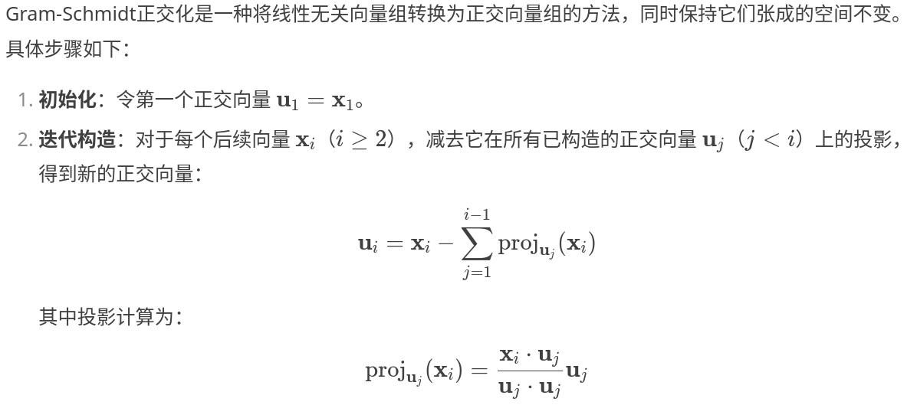

# Lect2
本次课程主要讲解了`最优化方法`中常用的线性代数知识，十分重要！

## 线性代数计算库
- Basic Linear Algebra Subroutines, BLAS 实现了数值代数基本操作
- LAPACK 包含了求解线性系统和进行常见矩阵分解的程序。
- Eigen3: C++ 矩阵计算库, MATLAB, Python 等都使用 Eigen3 做底层矩阵计算.
- MATLAB: 提供多种多样的线性代数计算程序
- Numpy: Python 的数值计算库, 提供多重线性代数计算程序.

## 编程
- 阅读 Gram-Schimit 正交化的内容, 并编程实现:
```text
给定线性无关向量组 {x1, · · · , xn}, 
寻找一组正交向量 u1, · · · ,un 使得span{x1, · · · , xn} = span{u1, · · · , un}.
```

- 使用 python 编程练习本节提到的内积, 范数, 和矩阵分解等计算.
```text
import numpy as np
np.linalg.eig(A)
```

### Gram-Schimit正交化算法框图


```plaintext
开始
│
├─ 输入: 线性无关向量列表 X = [x₁, x₂, ..., xₙ]
│
├─ 初始化正交向量列表 U ← 空列表
│
├─ 对每个 i ∈ 0 到 n-1 执行循环:
│   │
│   ├─ 步骤1: 获取当前向量
│   │   x_i ← X[i] (转换为浮点型)
│   │
│   ├─ 步骤2: 初始化正交向量
│   │   u_i ← x_i 的拷贝
│   │
│   ├─ 对每个 j ∈ 0 到 i-1 执行内层循环:
│   │   │
│   │   ├─ 投影系数计算
│   │   │   coeff ← (x_i ⋅ U[j]) / (U[j] ⋅ U[j])
│   │   │
│   │   └─ 正交化处理
│   │       u_i ← u_i - coeff × U[j]
│   │
│   └─ 步骤3: 存储结果
│       U.append(u_i)
│
└─ 输出: 正交向量列表 U = [u₁, u₂, ..., uₙ]
结束
```